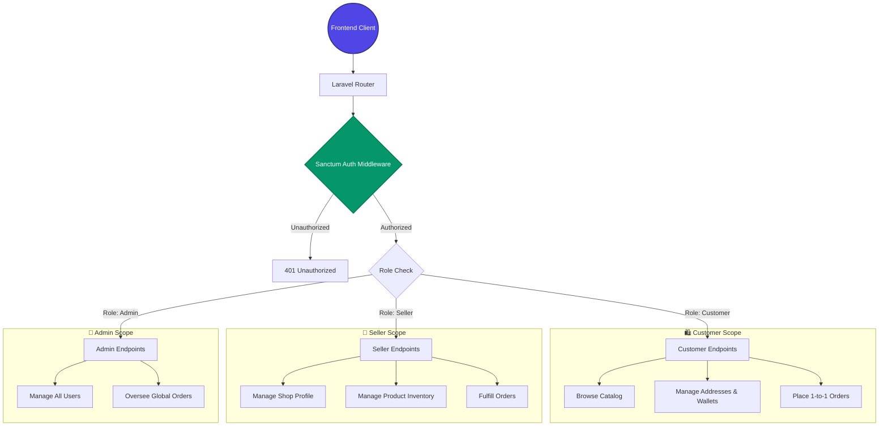
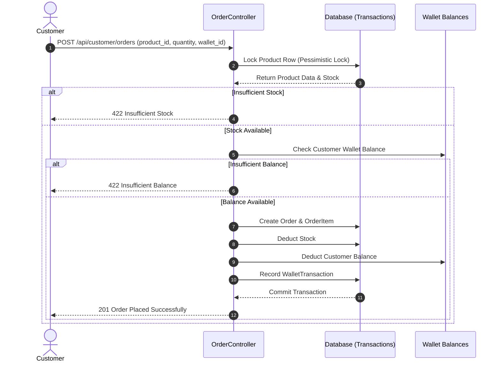

# 🛒 Marketplace API: Enterprise Laravel E-Commerce Backend

Welcome to the official API documentation for the **Marketplace API**, a robust, scalable, and secure headless e-commerce backend built with **Laravel 11** and secured via **Laravel Sanctum**. 

This platform supports a multi-tenant marketplace architecture featuring three distinct user roles: **Customers**, **Sellers**, and **Administrators**. It is designed with performance, security, and developer experience in mind.

---

## 📌 Table of Contents
- [Project Overview](#-project-overview)
- [System Architecture & Roles](#-system-architecture--roles)
- [Authentication Flow](#-authentication-flow)
- [API Endpoints Directory](#-api-endpoints-directory)
- [Database & Relationship Design](#-database--relationship-design)
- [Installation & Quick Start](#-installation--quick-start)

---

## 🚀 Project Overview

The **Marketplace API** serves as the single source of truth for our e-commerce ecosystem. It provides a RESTful interface for frontend clients to interact with our database securely.

### Tech Stack
*   **Framework:** Laravel 11 (PHP 8.2+)
*   **Authentication:** Laravel Sanctum (Stateful & Token-based)
*   **Database:** SQLite / PostgreSQL / MySQL
*   **Testing:** PHPUnit

---

## 👥 System Architecture & Roles

The system is built on a Role-Based Access Control (RBAC) model. Users are assigned one of three roles, which dictates their access to specific API routes.



### 1. 🛍️ Customer
*   **Scope:** Personal account space.
*   **Capabilities:** Browse public products, manage shipping addresses and digital wallets, place 1-to-1 single product orders, and view order history.

### 2. 🏪 Seller
*   **Scope:** Merchant/Shop space.
*   **Capabilities:** Manage their own seller profile, create and update their products (inventory), and manage orders containing their specific products. Sellers *cannot* see or modify products from other sellers.

### 3. 👑 Admin
*   **Scope:** Global system space.
*   **Capabilities:** Full read/write access to all resources. Can manage users (activate/suspend) and oversee all system orders.

---

## 🔐 Authentication & Order Flow

The API uses **Laravel Sanctum** for secure, token-based authentication. 

### Checkout & Order Sequence
Here is a sequence diagram illustrating the single-order checkout process, demonstrating the database locks and wallet deductions natively built into the `OrderController`:



---

## 🛣️ API Endpoints Directory

For comprehensive endpoint documentation including payloads and responses, refer to the individual docs:
- [Customer API Docs](docs/api/customer/readme.md)
- [Seller API Docs](docs/api/seller/readme.md)
- [Admin API Docs](docs/api/admin/readme.md)

### 1. Public Endpoints
| Method | Endpoint | Description |
| :--- | :--- | :--- |
| `POST` | `/api/auth/register` | Register a new customer or seller account. |
| `POST` | `/api/auth/login` | Authenticate credentials and return a Bearer Token. |
| `GET` | `/api/products` | List all active products. |
| `GET` | `/api/products/{id}` | Retrieve detailed information for a single product. |

### 2. Customer Endpoints
| Method | Endpoint | Description |
| :--- | :--- | :--- |
| `GET/POST` | `/api/customer/addresses` | Manage shipping addresses. |
| `GET/POST` | `/api/user/wallets` | Manage digital wallets and top-up balance. |
| `POST` | `/api/customer/orders` | Place a direct single-product order. |
| `GET` | `/api/customer/orders` | View personal order history. |
| `PATCH` | `/api/customer/orders/{order}/cancel` | Cancel a pending order and refund to wallet. |

### 3. Seller Endpoints
| Method | Endpoint | Description |
| :--- | :--- | :--- |
| `PUT` | `/api/seller/profile` | Update shop details (name, description). |
| `GET/POST/PUT` | `/api/seller/products` | Manage product inventory and stock. |
| `GET` | `/api/seller/orders` | List orders containing items sold by the seller. |
| `PATCH` | `/api/seller/orders/{order}/status` | Update fulfillment status (Processing, Shipped, Delivered). |

### 4. Admin Endpoints
| Method | Endpoint | Description |
| :--- | :--- | :--- |
| `GET` | `/api/admin/users` | List all registered users. |
| `PATCH` | `/api/admin/users/{user}/activate` | Activate/Deactivate a user account. |
| `GET` | `/api/admin/orders` | View all system-wide orders. |

---

## 🗄️ Database & Relationship Design

To ensure optimal performance and data integrity, the database schema utilizes standard relational constraints:

*   **Users:** System actors. Can have one `SellerProfile`.
*   **Wallets:** Associated with `Users`. Tracks digital currency.
*   **Products:** `belongsTo` a Seller. Uses soft deletes.
*   **Orders:** Single product orders. `belongsTo` a Customer and `belongsTo` a Seller. Contains status tracking and product details directly.

---

## 🛠️ Quick Start

### Step 1: Install & Configure
```bash
composer install
cp .env.example .env
php artisan key:generate
```

### Step 2: Database Setup
```bash
touch database/database.sqlite
php artisan migrate:fresh --seed
```

### Step 3: Serve
```bash
php artisan serve
```
The API will now be accessible at `http://127.0.0.1:8000`.

---